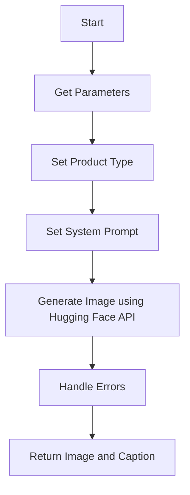
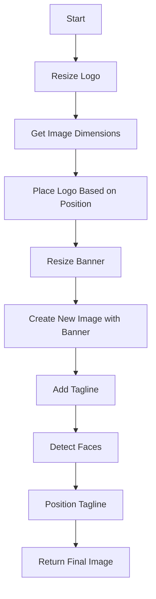
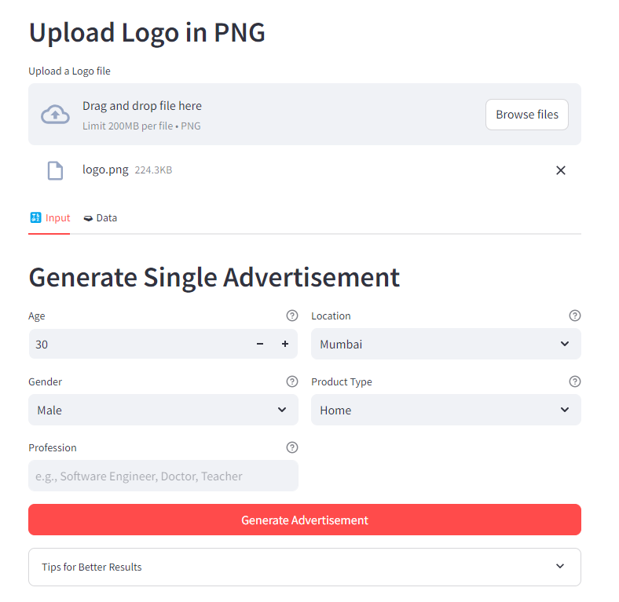
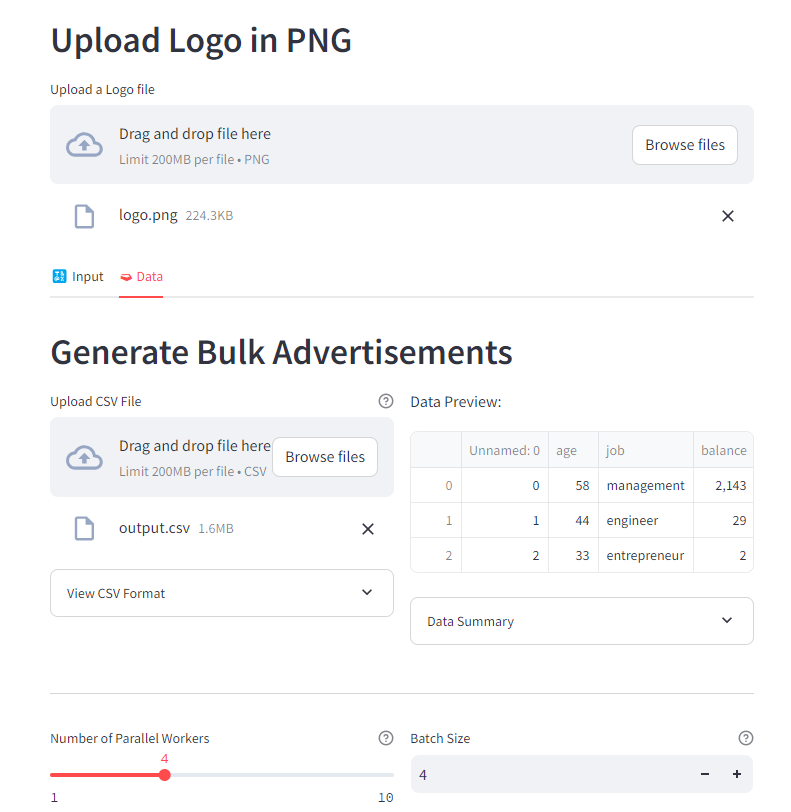

Check out the configuration reference at https://huggingface.co/docs/hub/spaces-config-reference
---
# **Dynamic Advertisement Generator**

## **Overview**
The **Dynamic Advertisement Generator** is a powerful tool designed to create personalized advertisements using artificial intelligence. It allows users to generate single or bulk advertisements by providing demographic and product information. The tool integrates AI-generated images, custom branding, and dynamic taglines to produce professional-quality ads.

This tool is particularly useful for marketing teams, financial institutions, and businesses looking to create targeted advertisements for different customer segments.

---

## Table of Contents
- [Installation](#Installation)
- [Usage](#Usage)
- [Features](#Features)
- [Screenshots](#Screenshots)
- [Flowcharts](#Flowchart)
  
## **Features**
1. **Single Advertisement Generation:**
   - Create personalized ads by providing age, gender, profession, location, and product type.
   - Add a custom logo and tagline to the generated advertisement.

2. **Bulk Advertisement Generation:**
   - Upload a CSV file containing customer data to generate multiple ads in one go.
   - Process ads in parallel for faster generation.

3. **AI-Powered Image Generation:**
   - Uses Hugging Face's `FLUX.1-dev` model to generate realistic images based on user inputs.
   - Ensures images are contextually relevant to the provided demographic and product information.

4. **Dynamic Taglines:**
   - Automatically adds catchy taglines to the advertisements.
   - Taglines are positioned intelligently to avoid overlapping with faces or logos.

5. **Custom Branding:**
   - Add your company logo to the advertisements.
   - Choose logo placement (top-left or top-right).

6. **Download Options:**
   - Download individual advertisements or all ads in bulk.
   - Advertisements are saved in high-quality PNG format.

7. **Progress Tracking:**
   - Real-time progress bar and status updates for bulk ad generation.
   - Displays the number of ads generated and remaining.

---

## **How It Works**

### **Flowchart**
```plaintext
+-------------------+
|  User Input       |
|  - Single Ad Form |
|  - CSV Upload     |
+-------------------+
          |
          v
+-------------------+
|  Validate Input   |
|  - Check CSV Data |
|  - Verify Fields  |
+-------------------+
          |
          v
+-------------------+
|  Generate Images  |
|  - AI Model       |
|  - Parallel Jobs  |
+-------------------+
          |
          v
+-------------------+
|  Add Branding     |
|  - Logo           |
|  - Tagline        |
+-------------------+
          |
          v
+-------------------+
|  Display & Save   |
|  - Grid Layout    |
|  - Download Buttons
+-------------------+
```


### Function Flow - `save_genimage`


### Function Flow - `apply_tagline_and_logo`

---

## **Usage**

### **1. Single Advertisement Generation**
1. **Upload Logo:**
   - Upload your company logo in PNG format.

2. **Fill in Details:**
   - Provide the following details:
     - **Age:** Age of the target customer (18-100).
     - **Gender:** Male or Female.
     - **Profession:** Profession of the target customer (e.g., Software Engineer, Doctor).
     - **Location:** City or region of the target customer.
     - **Product Type:** Type of financial product (e.g., Home Loan, Personal Loan).

3. **Generate Advertisement:**
   - Click the "Generate Advertisement" button.
   - The tool will create a personalized ad with your logo and a dynamic tagline.

4. **Download Advertisement:**
   - Once generated, you can download the ad in PNG format.

---

### **2. Bulk Advertisement Generation**
1. **Upload Logo:**
   - Upload your company logo in PNG format.

2. **Upload CSV File:**
   - Prepare a CSV file with the following columns:
     - `Product`: Type of financial product.
     - `age`: Age of the target customer (18-100).
     - `gender`: Gender of the target customer (Male/Female).
     - `job`: Profession of the target customer.
     - `location`: City or region of the target customer.

   Example CSV:
   ```csv
   Product,age,gender,job,location
   Home Loan,35,Male,Software Engineer,Mumbai
   Personal Loan,28,Female,Doctor,Delhi
   Business Loan,45,Male,Entrepreneur,Bangalore
   ```

3. **Configure Parallel Workers:**
   - Choose the number of parallel workers for faster processing.

4. **Generate Advertisements:**
   - Click the "Generate Advertisements" button.
   - The tool will process the CSV file and generate ads for each row.

5. **Download Advertisements:**
   - Once all ads are generated, you can download them individually or in bulk.

---

## **Technical Details**

### **Dependencies**
- **Python Libraries:**
  - `Pillow`: For image manipulation.
  - `streamlit`: For the web interface.
  - `huggingface_hub`: For accessing the AI model.
  - `face_recognition`: For detecting faces in images.
  - `pandas`: For processing CSV data.
  - `numpy`: For image processing.
  - `concurrent.futures`: For parallel processing.

- **AI Model:**
  - Uses Hugging Face's `FLUX.1-dev` model for text-to-image generation.

---

### **Parallel Processing**
- The tool processes multiple ads in parallel using `ThreadPoolExecutor`.
- The number of parallel workers is dynamically adjusted based on the number of ads to generate.

---

### **Image Processing Pipeline**
1. **Image Generation:**
   - The AI model generates a base image based on the provided demographic and product information.

2. **Logo Placement:**
   - The logo is resized and placed in the top-left or top-right corner of the image.
   - The tool ensures the logo does not overlap with detected faces.

3. **Tagline Addition:**
   - A dynamic tagline is added to the image.
   - The tagline is positioned to avoid overlapping with faces or the logo.

4. **Banner Addition:**
   - A custom banner is added at the bottom of the image.
   - The banner includes social media icons and a disclaimer.

---

## **Installation**

### **1. Clone the Repository**
```bash
git clone https://github.com/praykar/genai.git
cd dynamic-ad-generator
```

### **2. Install Dependencies**
```bash
pip install -r requirements.txt
```

### **3. Set Up Hugging Face Token**
- Obtain a Hugging Face API token.
- Add the token to `st.secrets` in Streamlit:
  ```toml
  # .streamlit/secrets.toml
  HF_TOKEN = "your-hugging-face-token"
  ```

### **4. Run the Application**
```bash
streamlit run app.py
```

---

## **Screenshots**

### **Single Advertisement Generation**


### **Bulk Advertisement Generation**


### **Download Options**


---

## **Contributing**
Contributions are welcome! Please follow these steps:
1. Fork the repository.
2. Create a new branch for your feature or bugfix.
3. Submit a pull request with a detailed description of your changes.

---

## **License**
This project is licensed under the MIT License. See the [LICENSE](LICENSE) file for details.

---

## **Contact**
For questions or feedback, please contact:
- **Email:** prakhar1@live.com
- **GitHub:** [praykar](https://github.com/praykar/genai.git)

---

## **Acknowledgments**
- Thanks to Hugging Face for providing the `FLUX.1-dev` model.
- Thanks to the Streamlit team for the amazing framework.

---

## Conclusion

This project provides a comprehensive solution for generating dynamic advertisements with AI. Customize your advertisements by providing appropriate inputs and generate bulk advertisements using CSV files for efficient marketing campaigns.

For more details, refer to the code in `app.py`.

Enjoy creating dynamic advertisements with ease! 🚀
